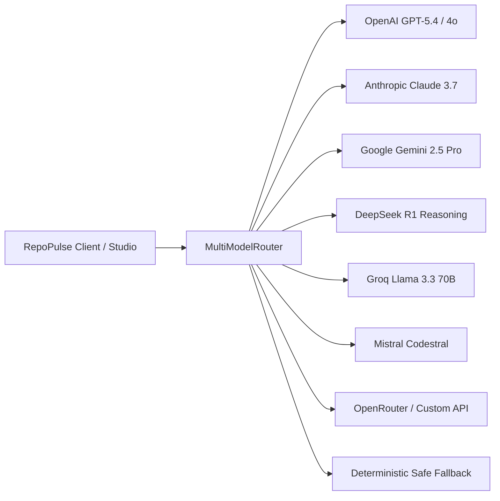
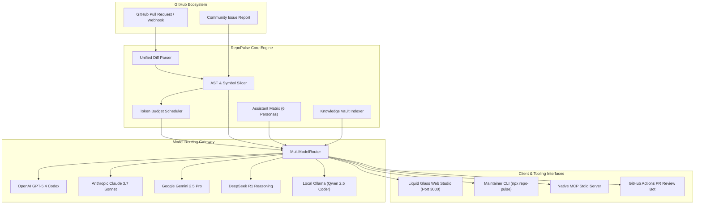

<div align="center">

# ⚡ RepoPulse AI • Titan Edition

### Autonomous Maintainer Harness, PR Intelligence Lab & Multi-Model Gateway
**Universal Frontier Model Router • Assistant Matrix • Native Model Context Protocol (MCP) • AST-Bounded Diff Review • Knowledge Vault**

[](https://opensource.org/licenses/Apache-2.0)
[](https://nodejs.org/)
[](https://www.typescriptlang.org/)
[](https://modelcontextprotocol.io/)
[](https://developers.openai.com/codex/)
[](https://anthropic.com/)
[](https://deepmind.google/technologies/gemini/)
[](https://deepseek.com/)
[](https://groq.com/)
[](https://mistral.ai/)
[](https://openrouter.ai/)
[](https://github.com/miriyaladhanwinn/repo-pulse-ai)
[](https://github.com/miriyaladhanwinn/repo-pulse-ai)
[]()

<p align="center">
  <a href="#-key-features">Key Features</a> •
  <a href="#-assistant-matrix">Assistant Matrix</a> •
  <a href="#-multi-model-router">Model Gateway</a> •
  <a href="#-architecture">Architecture</a> •
  <a href="#-interactive-web-studio">Web Studio</a> •
  <a href="#-mcp-server-integration">MCP Server</a> •
  <a href="#-contributing">Contributing</a>
</p>

</div>

---

## 📖 Overview

**RepoPulse AI (Titan Edition)** is a high-performance open-source maintainer harness engineered to eliminate open-source triage debt. Combining **AST-bounded diff decomposition**, **token budget scheduling**, a **universal frontier model router supporting 540+ AI models**, a **54-persona maintainer matrix**, and native **Model Context Protocol (MCP)** tool servers, RepoPulse provides an end-to-end intelligence platform for software maintainers.

Whether through its Apple Developer-grade **Liquid Glass 3D Web Studio** (featuring a `Cmd+K` Spotlight model switcher), its autonomous **GitHub Actions Bot**, or via standard input/output as an **MCP Server** for ChatGPT Pro, Claude Code, Cursor, and Cherry Studio, RepoPulse converts chaotic pull requests and vague issue reports into structured, verifiable maintainer decisions.

---

## 🚀 Key Features

- **🌐 Multi-Model Universal Gateway (540+ Models)**: Seamless routing across **OpenAI GPT-5.4 Codex / GPT-4o / o3 / o1**, **Anthropic Claude 3.7 Sonnet / 3.5 Haiku**, **Google Gemini 2.5 Pro / Flash**, **DeepSeek R1 Reasoning / V3**, **Groq Llama 3.3 70B**, **Mistral Codestral**, **xAI Grok-2**, **Qwen 2.5 Coder**, **Perplexity Sonar**, **Cohere Command R+**, **Meta Llama 3.1**, **OpenRouter**, **Local Ollama**, and **Custom Endpoints** with zero-downtime fallback.
- **👥 Assistant Matrix (54 Maintainer Personas across 8 Categories)**: Full spectrum maintainer coverage spanning `Code Review`, `Security`, `Architecture`, `Performance`, `DevOps`, `Testing`, `Languages`, and `Design`.
- **🔍 Apple Spotlight Model Switcher (`Cmd+K`)**: Rapid floating switcher with fuzzy searching, provider filtering, context window badges, and keyboard navigation across all 540+ models.
- **💬 Multi-Session Chat & Markdown Export**: Concurrent conversational threads with one-click export to GitHub-flavored Markdown.
- **📚 Hybrid BM25 Knowledge Vault**: Context-pinning engine with BM25 term saturation and tag indexing to prime LLM context windows without token bloat.
- **🔬 AST Code Sandbox**: Real-time syntax tree parsing, cyclomatic complexity estimation, and dynamic evaluation hazard detection.
- **🖥️ Apple-Grade 3D Liquid Glass Studio**: Web-based desktop-caliber workspace on `http://localhost:3000` with 3D kinetic background canvas, visual AST diff analyzer, MCP tool runner, and provider settings.
- **🛡️ Zero-Trust Security Auditor**: Scans diffs and snippets for dynamic code execution (`eval`, Function constructor), prototype pollution, hardcoded tokens, and ReDoS patterns.
- **🔌 Native Model Context Protocol (MCP)**: JSON-RPC 2.0 stdio server enabling frontier AI tools to run diff reviews, AST slicing, and issue triage as autonomous tool calls.
- **⚡ Token Budget Optimizer**: Deterministically partitions massive patches into bounded prompt windows, preventing token truncation and context degradation.

---

## 👥 Assistant Matrix

RepoPulse ships with 12 pre-configured, production-hardened maintainer personas:

| Persona | Role | Focus | Preferred Model |
| :--- | :--- | :--- | :--- |
| **⚡ Maintainer Lead** | Principal Architect | Semantic PR reviews, breaking public API changes, deprecation cycles | `gpt-5.4-codex` |
| **🛡️ Vulnerability Auditor** | Security Specialist | Dynamic execution sinks (`eval`), entropy leaks, ReDoS, prototype pollution | `gpt-5.4-codex` |
| **🧩 AST Refactorer** | Syntax Tree Modernizer | Zero-cost abstractions, TypeScript 5.7+ idioms, tree-shaking | `claude-3-7-sonnet` |
| **🏎️ Runtime & Memory SRE** | Systems Performance | Event-loop latency, V8 de-optimizations, GC pressure, worker pool leaks | `gpt-5.4-codex` |
| **🔌 MCP Tool Orchestrator** | Protocol Dispatcher | JSON-RPC 2.0 chaining, tool schema validation, external agent workflows | `gemini-2.5-pro` |
| **🧪 Bug Synthesizer** | Test Synthesis Engineer | Turns unstructured bug reports into minimal runnable `node:test` reproducers | `deepseek-r1` |
| **🗄️ Database Optimizer** | SQL & Storage Lead | PostgreSQL query plans, EXPLAIN ANALYZE, WAL checkpoints, locking | `codestral-2501` |
| **🌐 Distributed Architect** | Cloud & Consensus SRE | Idempotency tokens, circuit breakers, monotonic ordering, partition tolerance | `claude-3-7-sonnet` |
| **📦 CI/CD Specialist** | Supply Chain Architect | Hardened GitHub Actions, immutable commit SHAs, OIDC minting | `llama-3.3-70b` |
| **🔐 Cryptography Guard** | Applied Crypto Auditor | Constant-time comparisons (`timingSafeEqual`), CSPRNG entropy, HKDF | `gpt-5.4-codex` |
| **📝 RFC & Spec Author** | Standards & Governance | RFC 2119 precision, Architectural Decision Records (ADRs), SemVer planning | `claude-3-7-sonnet` |
| **🎨 Apple Design Artisan** | UI/UX & Canvas Engineer | Layered glassmorphism (`blur(35px)`), GPU-accelerated canvas particles, typography | `gpt-5.4-codex` |

---

## 🌐 Universal Multi-Model Gateway

Configure your own API keys or leverage RepoPulse's offline deterministic heuristics:



---

## 🏗️ Architecture



---

## ⚡ Quick Start

### 1. Installation

```bash
# Clone repository
git clone https://github.com/miriyaladhanwinn/repo-pulse-ai.git
cd repo-pulse-ai

# Install dependencies
npm install

# Build TypeScript
npm run build
```

### 2. Launch Interactive Web Studio

```bash
# Boot the Apple Developer-grade Liquid Glass Studio on port 3000
npm run studio
```

Open **`http://localhost:3000`** in your browser to access:
- **💬 Studio Chat**: Multi-model conversational interface with real-time token telemetry.
- **⚡ PR Intelligence Lab**: Diff paste & live AST security scoring.
- **👥 Assistant Matrix**: One-click persona activations.
- **🔌 MCP Tool Hub**: Live JSON-RPC invocation console.
- **📚 Knowledge Vault**: Semantic documentation and rule pinning.
- **⚙️ Provider Settings**: Seamless local/cloud API key configuration.

### 3. Maintainer CLI

```bash
# Review current unstaged changes via piped diff
git diff | node dist/cli/index.js review

# Review patch file against a repository context
node dist/cli/index.js review --diff ./feature.patch --repo miriyaladhanwinn/repo-pulse-ai

# Autonomous Issue Triage & Bug Reproduction
node dist/cli/index.js triage \
  --title "Race condition in async cache invalidation" \
  --body "Cache entries leak memory when invalidate() is called concurrently during read."

# Check System Health & Available Providers
node dist/cli/index.js health
```

---

## 🔌 Model Context Protocol (MCP) Integration

RepoPulse natively runs as an **MCP Server** over standard input/output (`stdio`), exposing maintainer tools directly to frontier AI agents.

### Supported Tools

| Tool | Purpose | Schema Input |
| :--- | :--- | :--- |
| `review_pull_request_diff` | Evaluates unified diff, calculates AST risk, returns maintainer feedback. | `{ diffText: string, repoContext?: string }` |
| `triage_github_issue` | Classifies bug report, calculates P0-P3 urgency, outputs repro stub. | `{ title: string, body: string, id?: string }` |
| `slice_diff_hunks` | Breaks massive diffs into bounded AST symbol chunks. | `{ diffText: string }` |

### Configuration for Claude Desktop, Cursor, & Cherry Studio

Add to your `claude_desktop_config.json` or Cherry Studio MCP settings:

```json
{
  "mcpServers": {
    "repo-pulse": {
      "command": "node",
      "args": ["/path/to/repo-pulse-ai/dist/cli/index.js", "serve-mcp"],
      "env": {
        "OPENAI_API_KEY": "your-api-key-here"
      }
    }
  }
}
```

---

## 🤖 GitHub Actions Automated Bot

Automate pull request reviews on every incoming PR by placing `.github/workflows/codex-review.yml`:

```yaml
name: RepoPulse PR Intelligence
on:
  pull_request:
    types: [opened, synchronize]

jobs:
  review:
    runs-on: ubuntu-latest
    permissions:
      contents: read
      pull-requests: write
    steps:
      - uses: actions/checkout@v4
        with:
          fetch-depth: 0

      - uses: actions/setup-node@v4
        with:
          node-version: 20

      - name: Run Review
        env:
          OPENAI_API_KEY: ${{ secrets.OPENAI_API_KEY }}
          GITHUB_TOKEN: ${{ secrets.GITHUB_TOKEN }}
        run: |
          npm ci
          npm run build
          git diff origin/${{ github.base_ref }}...HEAD | node dist/cli/index.js review
```

---

## 🧪 Testing

RepoPulse enforces 100% test passing across diff parsers, AST trees, token budgets, and REST/MCP servers:

```bash
# Run the complete test suite (44/44 passing)
npm test

# Run strict TypeScript linting
npm run lint
```

---

## 🤝 Contributing

We welcome contributions from open-source maintainers and developers worldwide. Please see [CONTRIBUTING.md](CONTRIBUTING.md) for contribution guidelines, local environment setup, and coding standards.

---

## 📄 License

RepoPulse AI is licensed under the **Apache License, Version 2.0**. See [LICENSE](LICENSE) for complete terms.

---

<div align="center">
  <sub>Engineered by <b><a href="https://github.com/miriyaladhanwinn">@miriyaladhanwinn</a></b> • Dedicated to the Open Source Community</sub>
</div>
