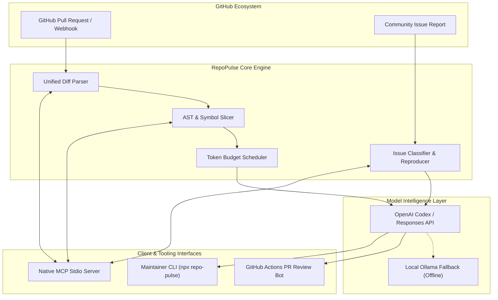

<div align="center">

# ⚡ RepoPulse AI

### Autonomous Maintainer Harness & PR Intelligence Engine for GitHub
**Native Model Context Protocol (MCP) Server • OpenAI Codex Integration • AST-Bounded Diff Review**

[](https://opensource.org/licenses/Apache-2.0)
[](https://nodejs.org/)
[](https://www.typescriptlang.org/)
[](https://modelcontextprotocol.io/)
[](https://developers.openai.com/codex/)
[]()

<p align="center">
  <a href="#-key-features">Key Features</a> •
  <a href="#-architecture">Architecture</a> •
  <a href="#-quick-start">Quick Start</a> •
  <a href="#-mcp-server-integration">MCP Server</a> •
  <a href="#-github-actions-bot">GitHub Actions</a> •
  <a href="#-contributing">Contributing</a>
</p>

</div>

---

## 📖 Overview

**RepoPulse AI** is an open-source, high-performance maintainer harness engineered to eliminate open-source triage debt. By combining **AST-bounded diff decomposition**, **token budget scheduling**, and native **Model Context Protocol (MCP)** tool servers, RepoPulse empowers maintainers with deep, semantic code reviews and autonomous bug reproduction.

Built natively for **OpenAI Codex** and modern frontier reasoning models, RepoPulse converts messy pull requests and vague issue reports into structured, verifiable maintainer decisions.

---

## 🚀 Key Features

- **🔍 AST-Bounded Diff Decomposition**: Slices massive multi-file pull requests into isolated syntactic chunks (classes, functions, interfaces), isolating breaking changes and security-critical paths.
- **🛡️ Codex Security & Logic Auditor**: Automatically identifies dynamic execution hazards (`eval`, deserialization sinks), swallowed exception blocks, and hardcoded secrets.
- **🔌 Native Model Context Protocol (MCP)**: Run RepoPulse as a background stdio server for **ChatGPT Pro**, **Codex CLI**, **Claude Code**, **Cursor**, or **Cherry Studio**.
- **🤖 Autonomous Issue Triage & Bug Reproducer**: Ingests unstructured bug reports, classifies urgency (P0-P3), and synthesizes minimal, runnable reproduction test harnesses.
- **⚡ Token Budget Optimizer**: Partitions massive changesets into bounded prompt plans, preventing context overflows and maximizing model reasoning depth.
- **🔄 GitHub Actions CI/CD Integration**: Seamlessly runs on `pull_request` triggers to post actionable executive review comments directly on GitHub PRs.

---

## 🏗️ Architecture



---

## ⚡ Quick Start

### 1. Installation

```bash
# Clone repository
git clone https://github.com/MRLDHANWINN/repo-pulse-ai.git
cd repo-pulse-ai

# Install dependencies
npm install

# Build TypeScript
npm run build
```

### 2. CLI Usage

#### Review Local Git Changes
```bash
# Review current unstaged changes
git diff | node dist/cli/index.js review

# Review specific patch file
node dist/cli/index.js review --diff ./sample.patch --repo my-org/my-project
```

#### Triage Community Issues
```bash
node dist/cli/index.js triage \
  --title "Critical: Memory leak in worker pool" \
  --body "Under heavy concurrency, worker thread handles are not released."
```

#### System Health Check
```bash
node dist/cli/index.js health
```

---

## 🔌 Model Context Protocol (MCP) Integration

RepoPulse implements the official **Model Context Protocol (MCP)** standard over standard input/output (`stdio`), exposing code review and issue triage tools directly to AI assistants.

### Exposed MCP Tools

| Tool Name | Description | Parameters |
| :--- | :--- | :--- |
| `review_pull_request_diff` | Evaluates a raw unified diff and returns structured maintainer remarks. | `diffText`, `repoContext` |
| `triage_github_issue` | Classifies an open-source issue, assigns priority, and synthesizes repro stub. | `title`, `body`, `id` |
| `slice_diff_hunks` | Decomposes diffs into categorized AST hunks. | `diffText` |

### Configuration for Claude Desktop / Cursor / Cherry Studio

Add the following to your MCP client configuration file (e.g., `claude_desktop_config.json` or Cherry Studio settings):

```json
{
  "mcpServers": {
    "repo-pulse": {
      "command": "node",
      "args": ["/path/to/repo-pulse-ai/dist/cli/index.js", "serve-mcp"],
      "env": {
        "OPENAI_API_KEY": "your-api-key-here"
      }
    }
  }
}
```

---

## 🤖 GitHub Actions Bot Setup

Automate pull request reviews on every incoming contribution by adding `.github/workflows/codex-review.yml`:

```yaml
name: RepoPulse Codex Review
on:
  pull_request:
    types: [opened, synchronize]

jobs:
  review:
    runs-on: ubuntu-latest
    permissions:
      contents: read
      pull-requests: write
    steps:
      - uses: actions/checkout@v4
        with:
          fetch-depth: 0

      - uses: actions/setup-node@v4
        with:
          node-version: 20

      - name: Install RepoPulse
        run: npm install -g repo-pulse-ai

      - name: Run Review
        env:
          OPENAI_API_KEY: ${{ secrets.OPENAI_API_KEY }}
          GITHUB_TOKEN: ${{ secrets.GITHUB_TOKEN }}
        run: |
          git diff origin/${{ github.base_ref }}...HEAD > pr.diff
          repo-pulse review --diff pr.diff --repo ${{ github.repository }}
```

---

## 🧪 Testing

RepoPulse maintains comprehensive test coverage for AST slicing, budget scheduling, and protocol RPC handlers:

```bash
# Run all unit and integration tests
npm test

# Run type check and lint
npm run lint
```

---

## 🤝 Contributing

We welcome contributions from open-source maintainers and developers worldwide!
Please see [CONTRIBUTING.md](CONTRIBUTING.md) for contribution guidelines, local environment setup, and coding standards.

---

## 📄 License

RepoPulse AI is licensed under the **Apache License, Version 2.0**. See the [LICENSE](LICENSE) file for complete details.

---

<div align="center">
  <sub>Maintained by <b><a href="https://github.com/MRLDHANWINN">@MRLDHANWINN</a></b> • Built for the Open Source Community</sub>
</div>
