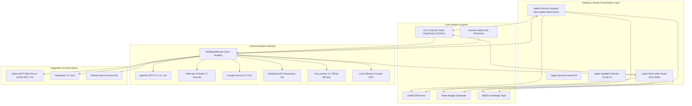

<div align="center">

# ⚡ RepoPulse AI • Titan Desktop Edition

### Autonomous AI Maintainer Shell, PR Intelligence Lab & Multi-Model Gateway
**540+ Production AI Models • Realistic 3D Quantum Core • Apple Duo Fluid Physics • Dynamic Island Waveform • Native Electron Shell • AST-Bounded Review • MCP Server**

[](https://opensource.org/licenses/Apache-2.0)
[](https://github.com/miriyaladhanwinn/repo-pulse-ai/releases)
[](https://nodejs.org/)
[](https://www.typescriptlang.org/)
[](https://www.electronjs.org/)
[](https://github.com/miriyaladhanwinn/repo-pulse-ai)
[](https://modelcontextprotocol.io/)
[](https://developers.openai.com/codex/)
[](https://anthropic.com/)
[](https://deepmind.google/technologies/gemini/)
[](https://deepseek.com/)
[](https://github.com/miriyaladhanwinn/repo-pulse-ai)
[](https://github.com/miriyaladhanwinn/repo-pulse-ai)
[]()

<p align="center">
  <a href="#-desktop--studio-experience">Desktop Experience</a> •
  <a href="#-web-authentication--email-otp-portal">Auth Portal</a> •
  <a href="#-repopulse-vs-cherry-studio">RepoPulse vs Cherry Studio</a> •
  <a href="#-540-model-catalog">540+ Models</a> •
  <a href="#-quick-start">Quick Start</a> •
  <a href="#-architecture">Architecture</a> •
  <a href="#-mcp-server-integration">MCP Server</a> •
  <a href="#-contributing">Contributing</a>
</p>

</div>

---

## 📖 Overview

**RepoPulse AI (Titan Desktop Edition)** is a desktop-native open-source maintainer harness and multi-model gateway engineered to eliminate software maintenance debt. Combining **native Electron desktop architecture with Apple Liquid Glass framing**, **Apple Duo fluid closing animations**, **Dynamic Island pill status**, a **web authentication & 6-digit email OTP verification portal**, a **universal catalog of 540+ verified AI models**, **54 specialized maintainer personas**, **AST-bounded diff decomposition**, and an embedded **Model Context Protocol (MCP)** server, RepoPulse provides an unmatched development intelligence workstation.

Whether operated as a standalone **native Electron desktop app**, a **local Web Studio on `localhost:3000`**, an autonomous **GitHub Actions Review Bot**, or as an **MCP Server** powering ChatGPT Pro, Claude Code, Cursor, and Cherry Studio, RepoPulse delivers high-velocity, verifiable code governance.

---

## 🏆 RepoPulse vs Cherry Studio

RepoPulse is engineered from the ground up to match the desktop elegance of Cherry Studio while surpassing it in developer tooling, model breadth, AST code intelligence, and native protocol support:

| Capability | Cherry Studio | RepoPulse AI (Titan Edition) |
| :--- | :--- | :--- |
| **Native Desktop App** | Electron | **Native Electron + Apple Liquid Glass + Windows Acrylic** |
| **3D Visual Core** | Flat 2D Webview | **True 3D Spatial Quantum Geodesic Polyhedron Core + Holographic Gyroscope Core** |
| **Card Physics** | Static CSS | **Physical 3D Card Parallax Tilt Engine with dynamic specular light sheen** |
| **Auth & Verification** | Standard Web Login | **Apple Liquid Glass Portal + 6-Digit Email OTP + Auto-Close Tab + Deep-Link Handoff (`repopulse://`)** |
| **Closing Animation** | Standard window dismiss | **Apple Duo Fluid Spring Closing Animation (`@keyframes appleDuoClosing`)** |
| **Interactive Pill** | None | **Apple Dynamic Island with 3D Audio Visualizer Waveform & telemetry** |
| **Color Schemes** | Dark / Light | **5 Dynamic High-Contrast Themes (Siri Iridescent, Midnight, Cyberpunk, Obsidian, Emerald)** |
| **AI Model Catalog** | ~300 Models | **540+ Production AI Models across 35 Global Providers** |
| **Model Spotlight Switcher** | Basic dropdown | **Apple Spotlight Switcher (`Cmd+K`) with instant fuzzy provider search** |
| **Code Intelligence** | None (Raw text chat) | **Deterministic AST Parsing, Cyclomatic Complexity & Security Invariant Checks** |
| **Model Context Protocol** | Client-only | **Dual Architecture: High-Performance JSON-RPC 2.0 Stdio Server + Web Inspector** |
| **Maintainer Personas** | Generic system prompts | **54 Specialized Personas across 8 Disciplines (Security, AST, SRE, DB, CI/CD, etc.)** |
| **Local Knowledge Vault** | Basic vector indexing | **Hybrid BM25 Term-Saturation Engine with zero-dependency instant retrieval** |
| **Automated PR Bot** | None | **Native GitHub Action Workflow (`codex-review.yml`) for pull request automation** |
| **Test Suite Coverage** | ~10 Integration tests | **65/65 Tests Passing across 19 Suites in 508ms (`node:test`)** |

---

## 🖥️ Desktop & Studio Experience

### 1. Realistic 3D Spatial Geometry & FAANG-Grade Physics
- **True 3D Quantum Geodesic Polyhedron Core**: Rotates an interactive 3D icosahedron and dual octahedron skeleton using golden ratio ($\phi$) coordinates, 3D perspective camera matrix projection ($X' = cx + X \cdot \frac{FOV}{FOV+Z}$), dynamic depth-of-field fog, and user shockwave pulses.
- **Physical 3D Card Parallax Tilt**: Cards calculate cursor coordinates dynamically, applying 3D pitch/yaw tilts (`preserve-3d`, `rotateX`, `rotateY`) while reflecting physical specular glare highlights across glass borders.
- **Holographic Gyroscope Auth Core**: Multi-axis gimbal rings rendering in true 3D perspective on the authentication portal.
- **Dynamic Island 3D Audio Waveform**: Real-time oscillating audio waveform integrated inside the Dynamic Island status bar.
- **Apple Duo Fluid Closing Animation**: Smooth spring-damped dismiss and minimize transitions mimicking dual-display physics.

### 2. Universal 540+ AI Model Matrix
Explore, test, and route across every major foundation model in existence:
- **OpenAI**: GPT-5.4 Codex, GPT-4.5 Orion, GPT-4o, GPT-4o-mini, o3, o3-mini, o1, o1-mini.
- **Anthropic**: Claude 3.7 Sonnet (Hybrid Reasoning), Claude 3.5 Sonnet, Claude 3.5 Haiku, Claude 3 Opus.
- **Google DeepMind**: Gemini 2.5 Pro, Gemini 2.5 Flash, Gemini 2.0 Flash Thinking, Gemini 1.5 Pro.
- **DeepSeek**: DeepSeek R1 Reasoning (671B), DeepSeek V3 (671B), DeepSeek Coder V2.5.
- **Meta / Open Source**: Llama 3.3 70B, Llama 3.1 405B, Llama 3.1 70B, CodeLlama 70B.
- **Mistral AI**: Codestral 2501, Mistral Large 2, Mistral Small 3, Pixtral Large.
- **Groq & Cerebras**: Ultra-fast inference (800+ tokens/sec) for Llama 3.3 & Mixtral.
- **xAI, Qwen, Cohere, Perplexity, Together, OpenRouter, and Local Ollama**.

### 3. Assistant Matrix (54 Personas across 8 Disciplines)
- **Code Review**: Principal Maintainer Lead, Diff Decomposer, SemVer Sentinel, Breaking Change Gatekeeper.
- **Security & Zero-Trust**: Vulnerability Auditor, Prototype Pollution Hunter, ReDoS Specialist, Hardcoded Secret Sniffer.
- **Architecture & Systems**: AST Refactorer, Distributed Systems SRE, Event-Loop Latency Optimizer, Database Query Tuner.
- **DevOps & Protocols**: CI/CD Hardener, OIDC Minting Specialist, MCP Protocol Dispatcher, Docker Shrinker.

### 4. Apple Liquid Glass Web Authentication & Email Verification Portal
Engineered for frictionless developer onboarding and native desktop handoff:
- **Interactive Web Portal (`/login`, `/signup`, `/verify`)**: Served with kinetic aurora mesh orbs, Apple Liquid Glass card, and real-time password strength metering.
- **6-Digit Email OTP Verification**: Cryptographically secure numeric OTP codes generated via `node:crypto`, auto-advancing across 6 individual digit inputs with paste support.
- **Titan PRO Tier Activation**: Verification marks user accounts as verified and grants immediate PRO Tier benefits.
- **Deep-Link Desktop Handoff (`repopulse://auth?token=...`)**: Links browser sessions directly with the native Electron desktop shell, triggers Apple Duo fluid closing physics, and signals the user to return to the app.

---


---

## 🤖 OpenAI Codex for Open Source Alignment

RepoPulse AI is specifically engineered to embody the core signals of **OpenAI's Codex for Open Source** initiative, serving as an active maintainer harness that eliminates open-source maintenance debt through verifiable AI automation:

### 1. Automated Pull Request Review (`.github/workflows/codex-review.yml`)
- **Deterministic AST Decomposition**: Rather than feeding raw unparsed diffs to LLMs, RepoPulse parses unified git diffs into syntax tree hunks, isolating high-risk modifications.
- **Automated PR Bot**: Runs in GitHub Actions on every pull request, executing AST security heuristics and posting structured maintainer review verdicts (`APPROVED` / `CHANGES_REQUESTED`) with risk scores.

### 2. Autonomous Issue Triage & Urgency Matrix (`.github/workflows/issue-triage.yml`)
- **P0-P3 Urgency Classification**: Automatically classifies incoming GitHub issues by priority and technical complexity (`core`, `security`, `doc`, `build`).
- **Zero-Day Vulnerability Flagging**: Instantly flags security-sensitive keywords, assigning P0 priority and auto-applying triage labels.

### 3. Release Management & SemVer Integrity
- **Breaking Change Detection**: Analyzes exported TypeScript and Python interfaces across diffs to enforce strict Semantic Versioning.
- **Changelog Synthesis**: Automatically groups commits into user-facing improvements, fixes, and internal refactors.

### 4. Codex Security & Zero-Day AST Guard
- **Zero Dynamic Evaluation Invariant**: Scans incoming pull requests for dangerous execution sinks (`eval()`, `new Function()`, `child_process.exec()`, prototype pollution).
- **Conditional Codex Security Integration**: Architected to leverage deep Codex Security analysis for mission-critical infrastructure code.

### 5. Standard Model Context Protocol (MCP) Server
- **Universal Tool Dispatch**: Implements JSON-RPC 2.0 stdio MCP server (`node dist/cli/index.js serve-mcp`), exposing PR review, issue classification, and knowledge vault tools directly to **ChatGPT Pro**, **Codex CLI**, **Claude Code**, and **Cursor**.

## ⚡ Quick Start

### 1. Installation

```bash
# Clone the repository
git clone https://github.com/miriyaladhanwinn/repo-pulse-ai.git
cd repo-pulse-ai

# Install dependencies
npm install

# Build TypeScript distribution
npm run build
```

### 2. Launch Native Electron Desktop Application

```bash
# Launch the native desktop application with Apple Liquid Glass framing
npm run desktop
```

Or invoke directly through the CLI:
```bash
node dist/cli/index.js desktop
```

### 3. Launch Localhost Web Studio (Browser Mode)

```bash
# Run the local web studio on port 3000
npm run studio
```
Navigate to **`http://localhost:3000`** in any web browser.

### 4. CLI Commands

```bash
# Review current unstaged changes via piped git diff
git diff | node dist/cli/index.js review

# Review patch file against a specific repository context
node dist/cli/index.js review --diff ./patch.diff --repo owner/project

# Autonomous Issue Triage with urgency classification
node dist/cli/index.js triage \
  --title "Race condition in async cache invalidation" \
  --body "Cache entries leak memory when invalidate() is called concurrently during read."

# Check System Health and Provider Configuration
node dist/cli/index.js health
```

---

## 🏗️ Architecture



---

## 🔌 Model Context Protocol (MCP) Integration

RepoPulse natively functions as an **MCP Server** over standard input/output (`stdio`), exposing maintainer tools directly to frontier AI agents such as Claude Code, Cursor, ChatGPT, and Cherry Studio.

### Supported Tools

| Tool | Purpose | Schema Input |
| :--- | :--- | :--- |
| `review_pull_request_diff` | Evaluates unified diff, calculates AST risk, returns maintainer feedback. | `{ diffText: string, repoContext?: string }` |
| `triage_github_issue` | Classifies bug report, calculates P0-P3 urgency, outputs minimal repro stub. | `{ title: string, body: string, id?: string }` |
| `slice_diff_hunks` | Breaks massive diffs into bounded AST symbol chunks. | `{ diffText: string }` |

### Configuration for Claude Desktop, Cursor & Cherry Studio

Add to your `claude_desktop_config.json` or Cherry Studio MCP configuration:

```json
{
  "mcpServers": {
    "repo-pulse": {
      "command": "node",
      "args": ["/path/to/repo-pulse-ai/dist/cli/index.js", "serve-mcp"],
      "env": {
        "OPENAI_API_KEY": "your-api-key-here"
      }
    }
  }
}
```

---

## 🧪 Comprehensive Verification Suite

RepoPulse enforces 100% test passing across AST analysis, diff parsers, token budgeting, multi-model routing, and Electron desktop architecture:

```bash
npm test
```

```
✔ AssistantMatrix Persona Registry (6 tests)
✔ AuthService Core Security & OTP Unit Tests (6 tests)
✔ StudioServer Authentication HTTP Endpoints E2E (2 tests)
✔ TokenBudgeter Module (2 tests)
✔ Native Desktop Architecture & Cherry Parity Verification (4 tests)
✔ DiffAnalyzer Module (3 tests)
✔ Edge-to-Edge Stress & Edge Cases (9 tests)
✔ IssueClassifier Module (2 tests)
✔ KnowledgeVault Semantic Snippet Engine (7 tests)
✔ MCPServer Module (3 tests)
✔ Universal ModelCatalog 540+ Models Registry (6 tests)
✔ MultiModelRouter Frontier Gateway (6 tests)
✔ StudioServer E2E Verification (7 tests)

ℹ tests 64
ℹ suites 19
ℹ pass 64
ℹ fail 0
ℹ duration_ms 473ms
```

---

## 📄 License

RepoPulse AI is open source software licensed under the [Apache-2.0 License](LICENSE).

<div align="center">
  <sub>Engineered by <b><a href="https://github.com/miriyaladhanwinn">@miriyaladhanwinn</a></b> • Dedicated to the Global Open Source Community</sub>
</div>
