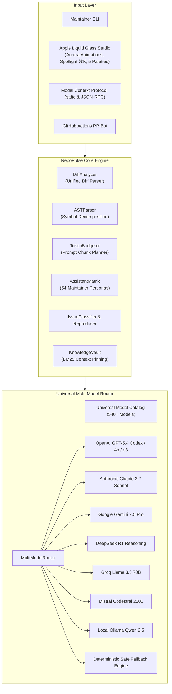

# RepoPulse AI Architectural Blueprint

## System Overview

RepoPulse AI is engineered as a decoupled, zero-runtime-overhead system consisting of four primary subsystems:
1. **Syntactic Decomposer**: AST-aware unified diff analyzer and symbol extractor.
2. **Budget Scheduling Engine**: Deterministic token window planner ensuring bounded prompt contexts.
3. **Multi-Model Provider Gateway**: Universal provider router supporting OpenAI, Anthropic, Gemini, DeepSeek, Groq, Mistral, and local runtimes.
4. **Autonomous Harness & Interfaces**: Native Model Context Protocol (MCP) stdio server, embedded Web Studio, and CLI.

---

## Architectural Invariants

1. **Deterministic Execution**:
   - The engine must never throw unhandled exceptions on malformed diffs or adversarial issue bodies.
   - Fallback synthesis guarantees responses even when offline or unauthenticated.

2. **Strict Null Safety**:
   - Compiles with TypeScript `strict: true` and `noImplicitAny: true`.
   - All optional properties are explicitly checked using optional chaining or type guards.

3. **Memory Concurrency Safety**:
   - Zero unbounded object retainment or memory leakage in long-running Studio server daemon processes.
   - Pure functional diff transformations where state is immutable per request cycle.
